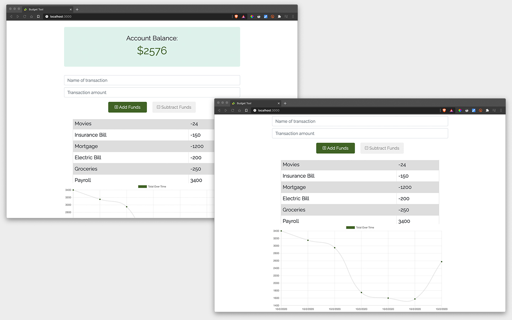

# Budget Tool

## Description

This budget tracking app offers offline access and capabilities to log deposits and expenses without an internet connection. Once the app is able to connect, the users entries will be logged. 



[]

## User Story

```
As a user,
I want to be able to track my finances offline and online,
so that I can maintain an accurate account balance at all times.
```

## Tech

- JavaScript
- Bootstrap
- npm Packages
  - compression
  - express
  - lite-server
  - mongoose
  - morgan

## License

[MIT](LICENSE)